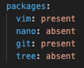
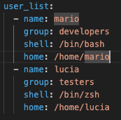

# Ansible_dizionari

## playbook1.yml
### Obiettivo
Creare un playbook Ansible che installi/disinstalli una lista di pacchetti in base a quanto definito in un apposito dictionary.
### Funzionamento
Questo playbook installa o disistalla una lista di pacchetti in base a quanto definito nel dictionary.

### Spiegazione
-  Il dizionario packages contiene il nome del pacchetto come chiave e lo stato (present o absent) come valore.

## playbook2.yml
### Obiettivo 
Creare un playbook Ansible che crei una lista di utenti usando le specifiche contenute in una lista di dictionary (ad esempio gruppo, home directory, shell, etc…).
### Funzionamento
Questo playbook crea gli utenti usando le specifiche contenute nel dictionary.

### Spiegazione
- La lista di dizionari user_list contiene le informazioni necessarie per la creazione degli utenti in formato chiave-valore.
- Il modulo group assicura che il gruppo esista prima della creazione dell'utente.
- Il modulo user crea ogni utente con le proprietà specificate.