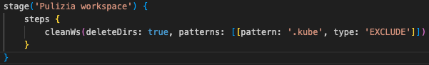
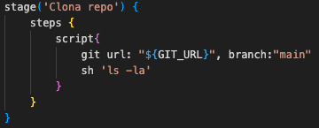
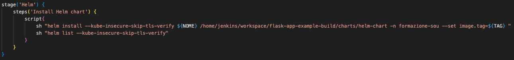

# Charts
### Parte 1
Creare un Helm Chart custom che effettui il deploy dell'immagine creata tramite la pipeline flask-app-example-build.

### Parte 2
Configurare il cluster Kubernetes, creato in locale sul Mac, con Jenkins, in modo che possa raggiungere anche il namespace "formazione-sou"
Scrivere pipeline dichiarativa Jenkins che prenda da GitHub il chart versionato in "formazione_sou_k8s" ed effettui "helm install" sull'istanza K8s locale su namespace "formazione-sou"

## Cosa è un chart?
Un chart Helm è un pacchetto contenente tutte le informazioni necessarie per distribuire un'applicazione su Kubernetes.

Un Helm chart permette di: 
- *Definire l'architettura di un'applicazione Kubernetes*
- *Standardizzare la distibuzione*
- *gestire le dipendenze*

Un chart Helm è composto da diversi file e directory:
- **Chart.yaml:** Definisce le informazioni di base del chart (nome, versione, dipendenze).
- **templates/:** Contiene i modelli YAML per le risorse Kubernetes.
- **values.yaml:** Definisce i parametri personalizzabili del chart. 

## Pipeline (jenkinsfile)
### Steps:
### 1. Pulizia workspace: 

### 2. Clone repo git 

### 3. Helm

## Requisiti
- Docker dekstop: running
- Jenkins master
- jenkins agent

## --insecure-skip-tls-verify
Questo flag disabilita la verifica TLS, quindi non viene verificata la validità dei certificati.
