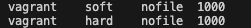
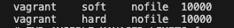
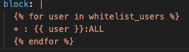

# Jinja_templates

Utilizzo dei template Jinja all’interno dei playbook Ansible.

## introduzione

I template Jinja sono in grado di generare file in maniera dinamica utilizzando variabili, costrutti condizionali e cicli.

## Esercizio 1

### Obiettivo

Creare un playbook Ansible che aggiunga in append sul file /etc/security/limits.conf alcuni settings per un’utente. In ambiente di produzione dobbiamo imporre un numero massimo di file aperti pari a 10000, mentre in ambiente di collaudo e sviluppo 1000.

### Metodo_esterno

Il vagrantfile crea una VM Ubuntu con immagine (Ubuntu/jammy64), il provision viene eseguito con ansible, tramite un playbook.

Collegandosi in shh nella VM si verifica che siano state svolte le azioni descritte nel playbook.

Il file (limits.conf.j2) imposta i limiti di di file aperti per ogni utente o ambiente indicato

### Metodo_in_line

Il vagrantfile crea una VM Ubuntu con immagine (Ubuntu/jammy64), il provision viene eseguito con ansible, tramite un playbook.

Collegandosi in shh nella VM si verifica che siano state svolte le azioni descritte nel playbook.

Nello specifico con riferimento all'ambiente "collaudo" e "sviluppo":

Ambiente "produzione":

## Esercizio 2

### Obiettivo

Supponiamo che in /etc/security/access.conf ci sia un’ultima riga che impedisce l’accesso agli utenti non esplicitamente autorizzati (“- : ALL : ALL”). Creare un playbook Ansible che aggiunga una lista di utenti in whitelist anteponendosi a tale riga (hint: utilizzare l’opzione insertbefore del modulo blockinfile).

### Descrizione

Il vagrantfile crea una VM Ubuntu con immagine (Ubuntu/jammy64), il provision viene eseguito con ansible, tramite un playbook.

Collegandosi in shh nella VM si verifica che siano state svolte le azioni descritte nel playbook.

Nel playbook viene utilizzato Jinja2 che esegue un ciclo per ogni utente e successivamente costruisce la riga della whitelist per ogni utente.

