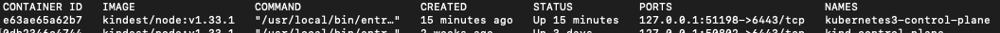
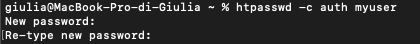
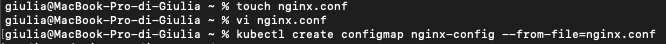
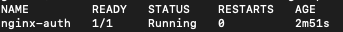
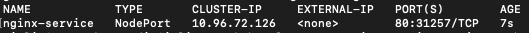
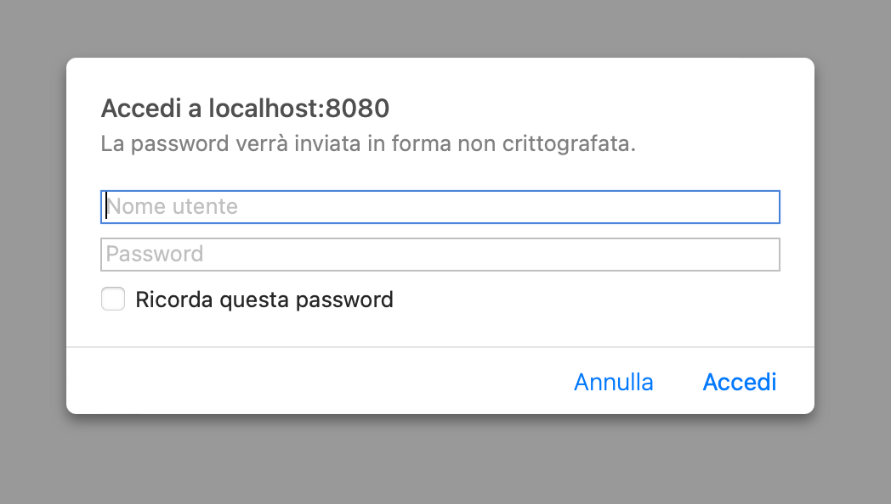
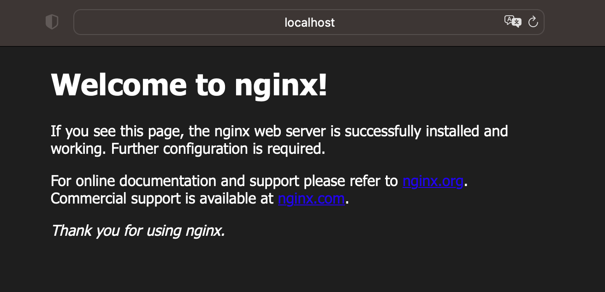

# Http Basic Authentication

## Obbiettivo

Creare un Pod Nginx con la Http Basic Authentication abilitata.

## Cosa fare

- Creare un file di password tramite l'utility htpasswd e mapparla nel Pod come un Secret
- Customizzare la configurazione di Nginx tramite una ConfigMap

## Prerequisiti

- **Docker:** necessario per eseguire Kind
- **Kind:** per creare cluster Kubernetes locale
- **Kubectl:** per interagire con il cluster

## Procedimento

1. Con kind ho creato il cluster:

2. installazione di httpd

3. Creazione file .htpasswd:

4. Creazione secret con file .htpasswd:

5. Creazione config map nginx (file nginx.conf)

6. Creazione del pod

7. Creazione service

8. Accesso con autenticazione

